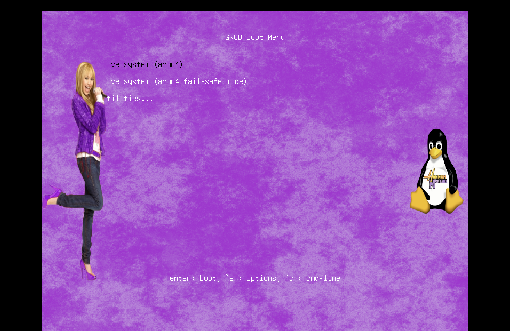
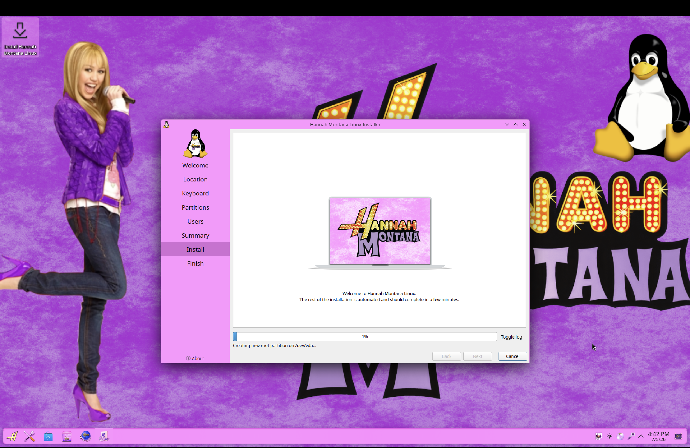
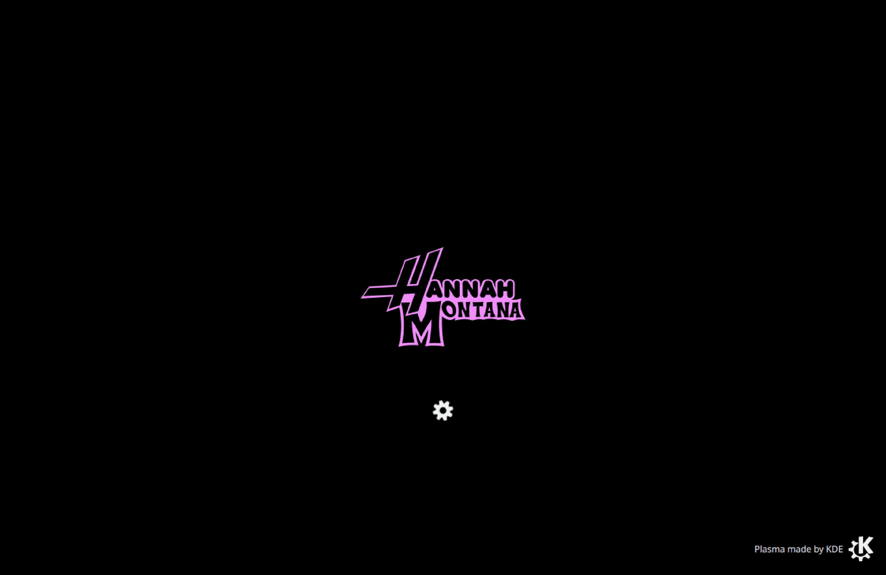
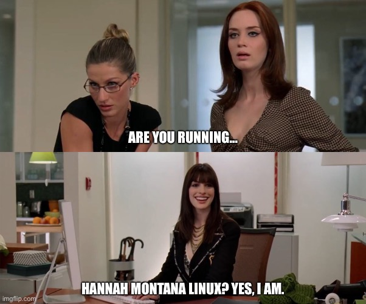

# Hannah Montana Linux v26 (ARM64)

---
Hannah Montana Linux v26.0 is a modern remaster of the [original Hannah Montana Linux](https://hannahmontana.sourceforge.net/). It uses Debian's [live-build](https://live-team.pages.debian.net/live-manual/html/live-manual/index.en.html) and the [Calamares installer](https://calamares.io/).

Much of this project is just a re-skin of [KDE Plasma](https://kde.org/plasma-desktop/). Many of the Plasma components are direct modifications of Plasma's default theme, [Breeze](https://github.com/kde/breeze). As such, this project is licensed under **GPLv3+**.

The original project was made as the focus of a video on the Noah Cagle [YouTube channel](https://www.youtube.com/@noah-cagle). You can watch the video [here](https://www.youtube.com/watch?v=VKx5UZsX9jw).

## Note: If you need a distro for old (x86) hardware, check out [HML26 Lite](https://gitlab.com/DecaCagle/HannahMontanaLinux26Lite)
The ARM64 project uses KDE Plasma 6 and SDDM. Plasma 6 can be sluggish on older machines. **Generally, you need about 8GB of RAM to run Plasma 6 comfortably**.

## Credits

This project is an unofficial Apple Silicon (ARM64) adaptation of **Hannah Montana Linux v26** by **Noah Cagle**.

This is an unofficial community adaptation. It is not affiliated with or endorsed by Noah Cagle or Disney.

Original project:
[Hannah Montana Linux v26.0](https://gitlab.com/DecaCagle/hannahmontanalinux26)

This repository ports the original x86 release to ARM64 while preserving its visual identity and overall user experience.

"Because Apple Silicon users also deserve to live the best of both worlds. 💀"

## Download

The latest pre-built ARM64 ISO is available on SourceForge:

[Download the latest ARM64 ISO from SourceForge](https://sourceforge.net/projects/hannah-montana-linux-arm64/files/v26.0-arm64/live-image-arm64.hybrid.iso/download)

GitHub Releases also link directly to the latest SourceForge download.

If you’d rather build the project from source, follow the instructions below.

## __Build from source__
**Requirements:**
Install live-build from the apt repository:
```
sudo apt install live-build
```

**Note:** live-build requires a Debian-based system. It will not work on other Linux distributions, not even inside of a Docker container (I tried).

__**Steps to build ISO**__
Clone this repository and navigate to it:
```
git clone https://github.com/eldritch-boyfriend/Hannah-Montana-Linux-Apple-Silicon-Edition.git && cd Hannah-Montana-Linux-Apple-Silicon-Edition
```

Run the live-build pre-configuration command:
```
lb config
```
Note: There is an executable script inside of the 'auto' directory called 'config'. If you have issues, make sure this file *is indeed executable*. When there is a config script in the 'auto' directory, live-build will automatically run *that* script when `lb config` is run.

Build the project with sudo:
```
sudo lb build
```
Note: This will take quite a while to complete. On my system, it takes around 10 minutes. It's also prone to eat up a lot of memory, so I recommend you close as many background apps as you can before building.

Once the build is completed successfully, you will find an ISO titled `live-image-arm64.hybrid.iso` at the root of the repository.

## Features

- 🍎 Native Apple Silicon (ARM64)
- 💜 Original Hannah Montana Linux aesthetic
- 🐧 Debian Live
- 🖥 KDE Plasma 6
- 💾 Bootable ISO
- 🛠 Built using Debian live-build
- 💻 Tested in UTM on Apple Silicon Macs

## Screenshots

## GRUB Boot Menu



## Installer



## Splash Screen



## About System



